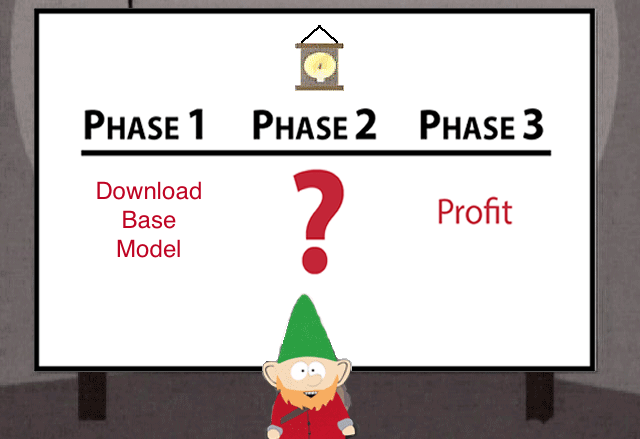

# R1-Zero Repro

An attempt to partially reproduce R1-Zero.

There will be (and likely are) more professional attempts at this, the sole purpose of this repository is to scratch a personal itch and try to learn something in the process.

[R1 Paper](https://arxiv.org/abs/2501.12948)

# Steps

# References & Libs

[TRL](https://huggingface.co/docs/trl/en/index)

[Smol](https://github.com/huggingface/smol-course)
